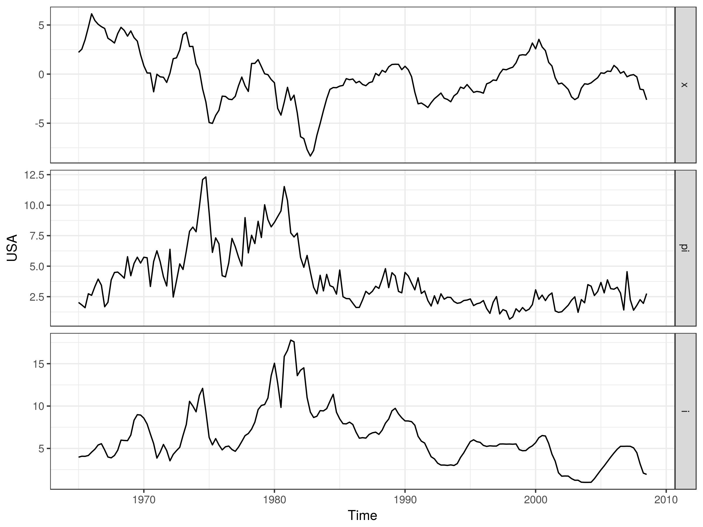

svars
=====

[](https://travis-ci.org/alexanderlange53/svars) 
[](https://cran.r-project.org/package=svars) 
[](https://cran.r-project.org/package=svars)

## Overview

svars contains data-driven identification methods for structural vector autoregressive (SVAR) models.
Based on an existing VAR model object (provided by e.g. VAR() from the 'vars' package), the structural impact relation matrix 
is obtained via data-driven identification techniques.

The cornerstone functions identify the structural errors

-   `id.cv()` by means of changes in volatility wit exogenous break.
-   `id.cvm()` via least dependent innovations based on Cramer-von Mises statistic.
-   `id.dc()` via least dependent innovations based on distance covariance matrix.
-   `id.ngml()` by means of non-Gaussian maximum likelihood.

These all return an estimated svars object with identified structural shocks and decomposed covariance matrix, for which the package contains varoius tools for further analysis.  


## Installation

```r
install.packages("svars")
```

Alternatively, install development version


```r
install.packages("devtools")
devtools::install_github("alexanderlange53/svars")
```


```r
library("svars")
```

## Usage

To get started, use the example data set which comes with the package. The data set consists of three U.S. macroeconomic time series, output gap (x), inflation (pi) and interest rates (r). For more details on the data set, please look into the description file `?USA`.

```r
ggplot2::autoplot(USA, facet = TRUE) + ggplot2::theme_bw()
```


